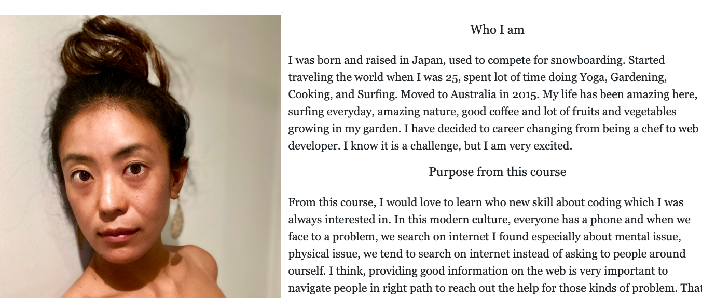

# Homework_Week2_
This is my second week homework from BCS.
I have made biography page.

## Requirement

In this assignment, I was required to do few things below lists,

* Create the following files files: `index.html`, `portfolio.html` and `contact.html`.

* Using Bootstrap, develop your portfolio site with the following items:

   * A navbar

   * A responsive layout

   * Responsive images

* The Bootstrap portfolio should minimize the use of media queries.

* also, there was bonus to use Sticky footer and sub-row and sub-columns

## My work

* All three page
 * I put Navigation bar with links in each pages
 * I put sticky footer on the bottom 
 * I have used media query to either on html or css to syow responsive layout

* About me page 
 * The image photo become smaller for smaller screen

* Portfolio page 
 * showing 4 photos for large screen, 2 for midium, then 1 for small screen
 * comment for the photos in sub-row

* Contact 
 * Image on the side disappear when screen becomes smaller but backgroung images shows up for sm and midium screen 
 
 

## What I learned from this homework
* Using bootstrap to make all the website page easily good looking in same style of consept
* How important to make relative layout
* Front end work is so fun!