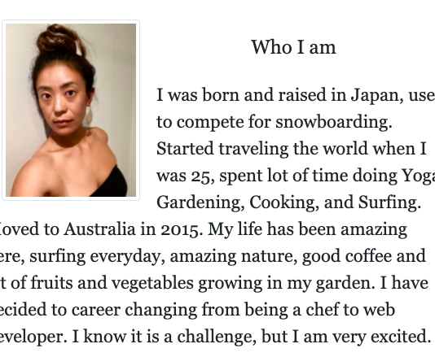
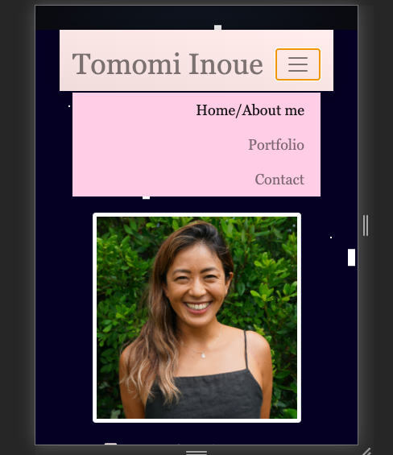

# Homework_Week2_Updated
Updating my portfolio page I made from week2

## Requirement

* Submit an updated portfolio featuring Project 1 and two exemplary homework assignments.

* Submit an updated GitHub profile with pinned repositories featuring Project 1 and two exemplary assignments.

* Submit an updated resume

* Submit an updated LinkedIn profile

## My work_Original

* All three page
 * I put Navigation bar with links in each pages
 * I put sticky footer on the bottom 
 * I have used media query to either on html or css to syow responsive layout

* About me page 
 * The image and paragraph is working as a sub-colomns

* Portfolio page 
 * showing 4 photos for large screen, 2 for midium, then 1 for small screen
 * comment for the photos in sub-row

* Contact 
 * Image on the side disappear when screen becomes smaller but backgroung images shows up for sm and midium screen 
 
 

## Key upddate
 * Full color and animation changed adding page links
 
 

  * Update resume
 

  * Update github page
 

  * Update rgithub page
 

 * Mobile responsive
 

## What I learned from this homework
* Using bootstrap to make all the website page easily good looking in same style of consept
* How important to make relative layout
* Front end work is so fun!

## What I learned from this update
* Very surprised me conpare to first time I made this page, all the html, css code writing became more natural to me.
It is very fun to work on front-end, easy to see the result, easy to see the problem.
Also made me really excited to see own portfolio page that I am on the way to become web developer..
However, I am looking forward to work on more back-end from next week.